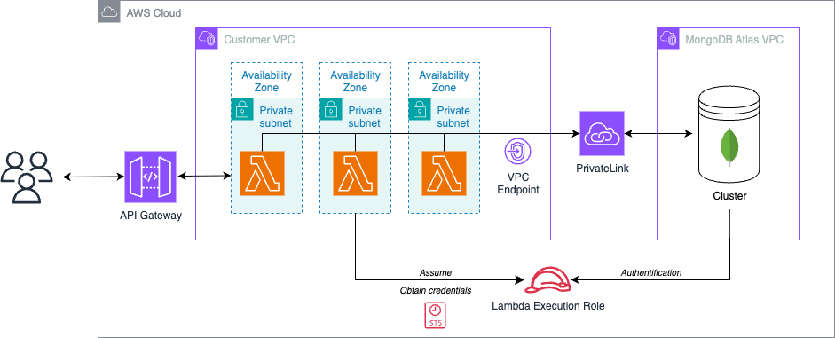

# AWS-Atlas-PrivateLink

Provision a secure, private connection between AWS Lambda and MongoDB Atlas using Terraform and AWS PrivateLink (For Demo purposes only) with IAM role authentification with short lived access credentials.



## Features
- Automated VPC, subnets, and security group setup
- MongoDB Atlas cluster and IAM user provisioning
- AWS Lambda deployment with VPC integration
- API Gateway proxy integration for Lambda
- PrivateLink endpoint creation and connection

## Prerequisites
- AWS account with programmatic access (Access Key, Secret Key, Session Token)
- MongoDB Atlas account
- Atlas organization and project created
- Atlas API keys (public and private)
- Terraform >= 1.0
- Python 3.x (for Lambda function)

## Quick Start
1. **Clone this repo:**
   ```sh
   git clone https://github.com/scott-thomas/AWS-Atlas-PrivateLink.git
   cd AWS-Atlas-PrivateLink
   ```
2. **Configure your variables:**
   - Copy `terraform.example.tfvars` to `terraform.tfvars` and fill in your credentials and project info.
3. **Create a python virtualenv:**
   ```sh
   python3 -m venv .venv
   source .venv/bin/activate
   ```
4. **Initialize and apply Terraform:**
   ```sh
   terraform init
   terraform apply
   ```
## API Usage
- The deployed API Gateway exposes your Lambda at:
  `https://<api-id>.execute-api.<region>.amazonaws.com/dev/movies` GET Endpoint that returns a list of movies from MongoDB Atlas.

## Project Structure
```
modules/
  aws/
    function/         # Lambda source code and build assets
    ...               # VPC, Lambda, API Gateway, etc.
  mongodb/            # Atlas cluster and user resources
main.tf               # Root Terraform configuration
variables.tf          # Input variables
terraform.tfvars      # User secrets and project config
```

## Security
- Never commit your `terraform.tfvars` or secrets to version control.
- Use AWS Secrets Manager or environment variables for sensitive data in production.

## License
MIT
